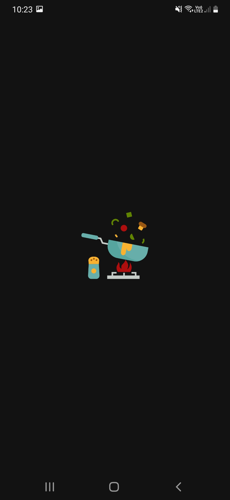
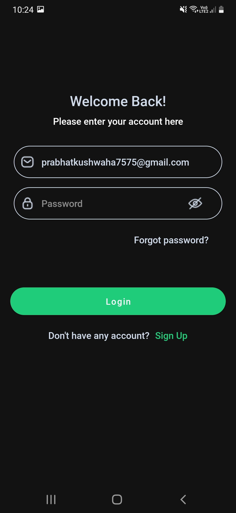
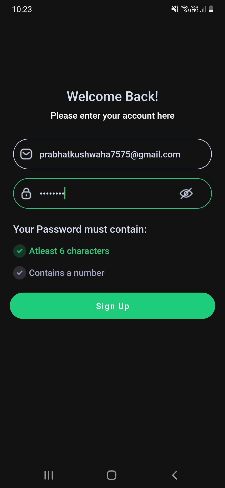
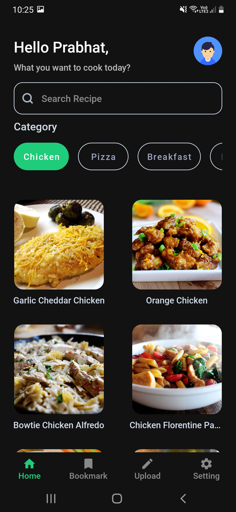
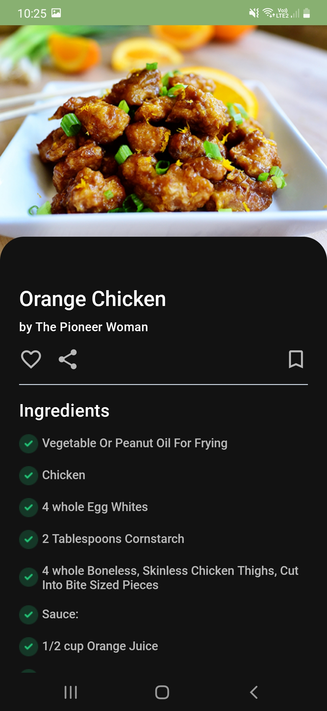

# MyChef
### 📱 Screenshots
#### App Features
|  |  |  |  | | 
|:---:|:---:|:---:|:---:|:---:|
|Home Screen| Word Details| Word Till Date| Bookmark Words| Settings|
### 📦 Technology Used
    • MVI architectural pattern
    • Kotlin
    • Coroutines
    • Flows and channels
    • Network layer (Retrofit)
    • Caching layer (Room Persistence)
    • Navigation Components
    • Hilt
    • BuildSrc
    
  
